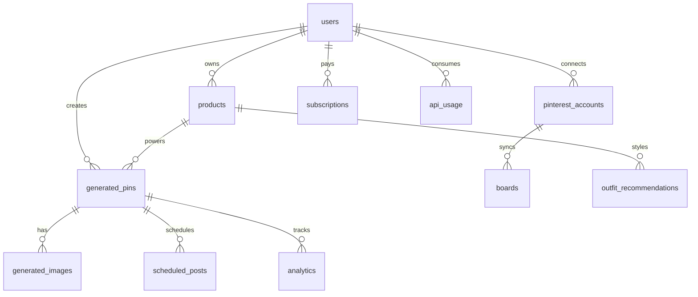

# PinFashion AI Architecture

## High-Level Architecture

Next.js 15 App Router serves the SaaS UI and API routes. Auth is handled by NextAuth with Prisma Adapter. MySQL is the system of record. Redis and BullMQ process bulk generation and scheduled Pinterest publishing. OpenAI creates SEO copy and outfit recommendations. Replicate creates 1000x1500 faceless fashion imagery, which is uploaded to Cloudinary. Pinterest OAuth connects user accounts and publishes generated pins.

## Low-Level Architecture

- UI: `app/*` pages and `components/*` provide dashboard, create pin, bulk, outfit, analytics, schedule, settings, billing.
- API: `app/api/*` validates requests with Zod, checks session, rate limits, calls services, writes Prisma records.
- Services: `services/scraper.ts`, `ai-content.ts`, `image-generation.ts`, `pinterest.ts`, `outfit.ts`, `cloudinary.ts` isolate provider logic.
- Workers: `workers/*` run BullMQ jobs using Redis.
- Database: Prisma models map to MySQL tables with indexes for user/time/status queries.

## API Architecture

- `POST /api/scrape`: scrape title, images, brand, price, category, gender, fashion style.
- `POST /api/generate/content`: create titles, descriptions, tags, hashtags, board suggestions, layouts.
- `POST /api/generate/image`: create faceless Pinterest image variants and save Cloudinary URLs.
- `POST /api/outfit`: generate complete outfit combinations.
- `POST /api/bulk/upload`: queue CSV product generation.
- `POST /api/pins/schedule`: queue a delayed Pinterest publish job.
- `POST /api/pins/publish`: publish immediately to Pinterest.
- `GET /api/analytics`: aggregate pin performance data.
- `GET /api/pinterest/oauth/start|callback`: OAuth connect flow.

## DB Diagram

## Queue Architecture

Bulk jobs scrape product rows, generate SEO content, generate images, and persist draft pins. Pin publishing jobs are delayed until the scheduled time and retry with exponential backoff.

## Image Pipeline

Product image and metadata feed the image prompt. The prompt enforces 1000x1500 vertical output, luxury editorial styling, and no visible faces. Replicate returns image URLs, Cloudinary stores optimized assets, and generated images attach to pins.

## Pinterest Posting Flow

User connects Pinterest via OAuth. Access and refresh tokens are encrypted. Boards are synced into MySQL. A generated pin can be published immediately or scheduled. The worker sends the Cloudinary image URL, SEO title, description, and destination affiliate link to Pinterest.
